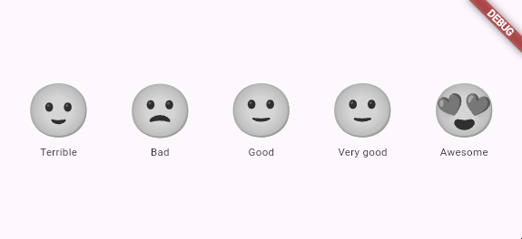

# flutter_emoji_feedback 
[](https://pub.dartlang.org/packages/flutter_emoji_feedback)

A fully customizable widget to receive feedback from your users. Can be used to get user's mood, evaluate experience, and more!

<div align="center">

</div>

### 📺 What's new?
You can now use animated lottie files (json only) for emoji presets, or the provided `notoAnimatedEmojis` preset.

## 🚀 Getting started


<!--Install from pub : ```dart
$ flutter pub add flutter_emoji_feedback
```
-->

Add this to your `pubspec.yaml`:
```yaml
flutter_emoji_feedback:
  git:
    url: https://github.com/turtlepaw/flutter_emoji_feedback.git
```

## 📔 Usage 

Import flutter_emoji_feedback :

```dart
import 'package:flutter_emoji_feedback/flutter_emoji_feedback.dart';
```

```dart
EmojiFeedback(
  rating: 4, // Rating 
  animDuration: const Duration(milliseconds: 300), // Duration of the animation
  curve: Curves.bounceIn, // Curve of the animation
  inactiveElementScale: .5, // Scale of the inactive element
  onChanged: (value) { // Callback when the user change the value of the emoji
  },
  // Other parameters
);
```

## 📝 License

This project is licensed under the MIT License - see the [LICENSE](LICENSE) file for details

## 📄 Changelog

See [CHANGELOG.md](CHANGELOG.md) for details.

## 📄 Contributing

Contributions are what make the open source community such an amazing place to learn, inspire, and create. Any contributions you make are **greatly appreciated**.

1. Fork the Project
2. Create your Feature Branch (`git checkout -b feature/AmazingFeature`)
3. Commit your Changes (`git commit -m 'Add some AmazingFeature'`)
4. Push to the Branch (`git push origin feature/AmazingFeature`)
5. Open a Pull Request

## 📄 Contact

- Twitter : [@nossesteve](https://twitter.com/nossesteve)
- GitHub : [@stevenosse](https://github.com/stevenosse)

## 📄 Acknowledgments

- [flutter_svg](https://pub.dev/packages/flutter_svg)
- [collection](https://pub.dev/packages/collection)

## Attribution
This project uses [Animated Noto Emoji](https://github.com/googlefonts/noto-emoji), which is licensed under the [Creative Commons Attribution 4.0 International License (CC BY 4.0)](https://creativecommons.org/licenses/by/4.0/).

© Google LLC. Licensed under CC BY 4.0.
